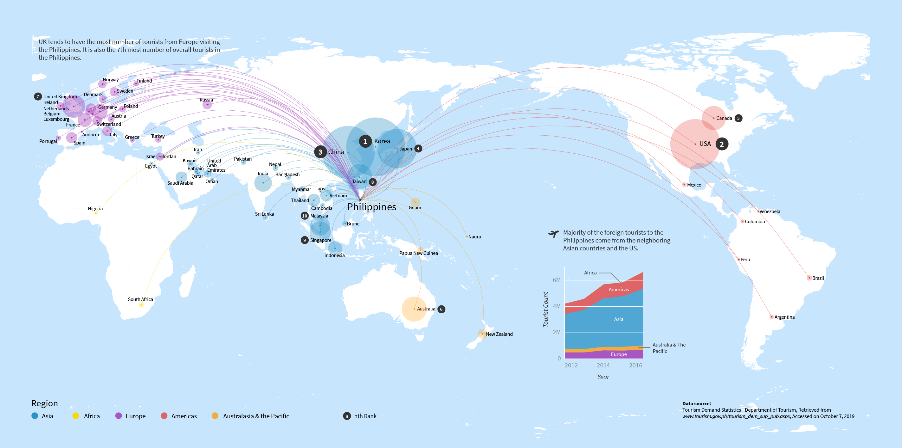

 

#VISUALIZAATION OF TRAFFIC 


This is an [R Markdown](http://rmarkdown.rstudio.com) Notebook. When you execute code within the notebook, the results appear beneath the code. 

Try executing this chunk by clicking the *Run* button within the chunk or by placing your cursor inside it and pressing *Ctrl+Shift+Enter*. 


## DATA SOURCES AND CLEANUP 

```{r}
#install.packages("rvest")
```

https://cran.r-project.org/web/packages/rvest/vignettes/selectorgadget.html 


## VISUALIZATION TOURISM ORIGIN COUNTRIES MAP
  

```{r}
#install.packages("rvest")
```

## VISUALIZATION TOURISM ORIGIN BUMPCHART
  
 
```{r}
#install.packages("rvest")
```
## VISUALIZATION PHILIPPINES TOURSITS HOTSPOTS - DOMESTIC AND INTERNATIONAL
 
 
 
## Data Sources
CebuPacific Annual Report 2018 ,
https://ir.airasia.com/newsroom/AAGB_-_Annual_Report_2018_(Part_4).pdf
https://cebupacificaircorporate.com/2018CEBAR/files/2018-CEB-Annual-Report.pdf;
http://tourism.gov.ph/tourism_dem_sup_pub.aspx;
Mactan Cebu International Airport, Passengers ( 2018 ),
https://drive.google.com/file/d/1IFA7EuAe2uaLvwu89jVC1dV0TNWd36qF/view
DEPARTMENT OF TOURISM Regional Tourism Arrivals , Provincial Tourism Arrivals (2019), Sources of Data: A/D Cards & Shipping Manifests Prepared by: Statistics, Economic Analysis and Information Management Division Office of Tourism Development Planning, Research and Information Management Tourism Development,
http://www.tourism.gov.ph/tourism_dem_sup_pub.aspx
mysay@tourism.gov.ph;
2019 Civil Aviations Authority of the Philippines, available via Open Data Philippines,
https://data.gov.ph/?q=dataset/civil-aviation-authority-philippines-passenger-movement
Maria Bialecka (2010) Filipiny Analiza Rynku Turystycznego, Akademia Wychowania Fizycznego,
https://wtir.awf.krakow.pl/pdf/studenci/strony_st/projekty/filipiny/bialecka.pdf
CAPA / Aviation Week by INFORMA,
https://centreforaviation.com/analysis/reports/philippines-international-aviation-market-booming-passenger-growth-410102
Henderson, J.C. (2011) TOURISM DEVELOPMENT AND POLITICS IN THE PHILIPPINES,
https://pdfs.semanticscholar.org/fbee/3d95184176e10bbbadeb0a14f89bf7031a5b.pdf
Rufino, Cesar. (2018). Forecasting Monthly Tourist Arrivals from ASEAN+3 Countries to the Philippines for 2015-2016 Using SARIMA Noise Modeling. Related: Rufino, Cesar. (2018). Tourist Arrivals from Korea, US, Japan and China to the Philippines: Two-year Ahead Monthly Forecast Scenarios. Rufino, Cesar. (2015). Forecasting Tourist Arrival from ASEAN+3 Countries to the Philippines.,
https://www.researchgate.net/publication/331562606_Tourist_Arrivals_from_Korea_US_Japan_and_China_to_the_Philippines_Two-year_Ahead_Monthly_Forecast_Scenarios
Trip Advisor, Record Number of Foreigners Visit the Philippines in 2018,
https://www.tripadvisor.co.uk/ShowTopic-g294245-i3256-k12278521-Record_number_of_foreigners_visit_Philippines_in_2018-Philippines.html
Jung, Thomas (2010) Tourism in Metropolitan Manila - Philippines: An Analysis,
https://core.ac.uk/download/pdf/12010740.pdf
Boracay Boats and Tourists, Wikimedia,
https://commons.wikimedia.org/wiki/File:Boracay_Boat_and_Tourists.jpg